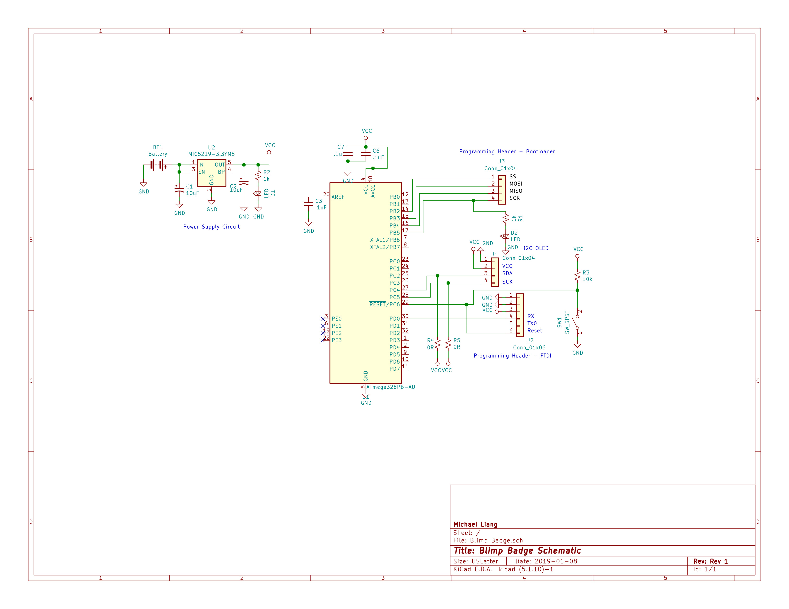

## Introduction to the Blimp Badge

This a page about the Blimp Badge which is a Atmega328p based badge made for the Sophmore career fair at UAkron to showcase my skills in embedded systems design, circuit layout and programming. The badge features a .96" I2C OLED that outputs a QR code my website mllelectronics.com which has my resume and project portfolio on it. 

## Hardware Layout & Design Considerations

The badge is based on Atmega328P and utilzes the internal 8mHz clocking running on 3.3V. Power is provided by a the "INSERT NAME" regulator. The chosen display was a generic .96" I2C OLED module powered by the SSD1306 CMOS display driver. All components were surface mount with all of them being 1206 sized in order to make everything hand solderable. 

Some interesting design choices that were made such as utilzing the internal clock and the usage of AAA batteries. The internal clock was utilzed as it would have reduced component count and complexity of the design. Normally it would be preferable to have an external clock provides precise timing and accuracy which are needed in asynchronous protocols such as UART or implementation of high speed protocols such as USB. However since I was only utilzing a single I2C bus which is synchronous. AAA batteries were utilized as they easily avaiable and not prone to challanges faced by utilizing a LIPO based battery system. 

## Software Used
* KiCad V5.1 - PCB Schematic and Electronic Design Software
* Arduino IDE  - AVR as ISP to program the board
* Solidworks 2019 - Mechanical design software 
* Inkscape - Vector graphics editor to design blimp shape 

## Lessons Learned 
There were several lessons learned with this project as I had tight timeline to produce and finish this before the Fall 2019 career fair at UAkron. 

1. Check if your I2C device has pull up resistors and design in zero ohm resistors to fix if necessary. 
2. Ensure that core components such as the processor are in stock and are purchased before starting schematic and PCB layout 
3. Converting between a Bitmap image to Vector graphic is difficult but extremely rewarding when done 

## Future Plans 
* Make a revision 2 of the Blimp Badge 
* Add an external clock circuit so that additional sensors can be utilized. 
* Add an ESP8266 module for wireless capability 

