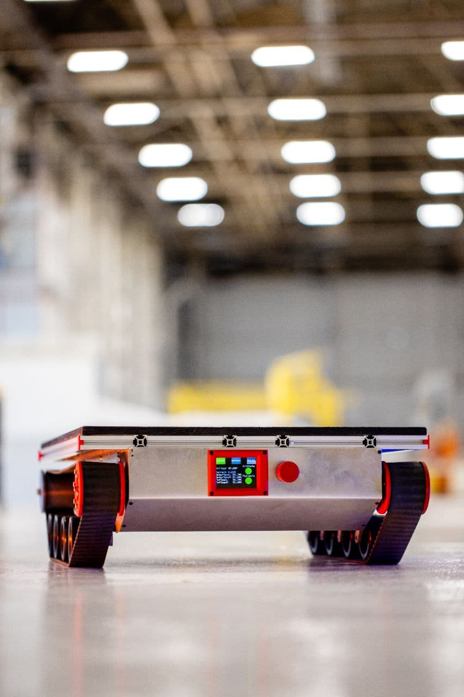
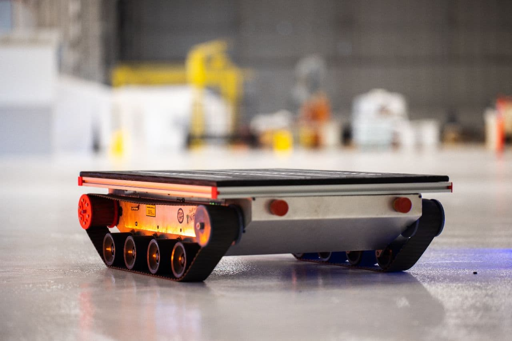
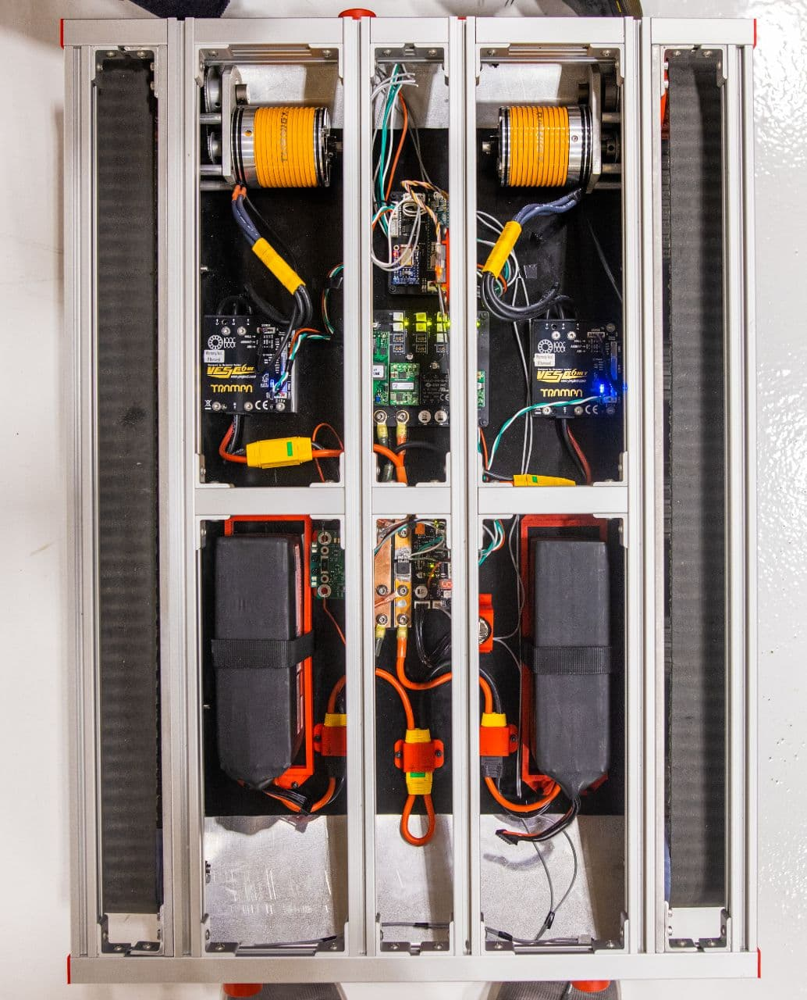
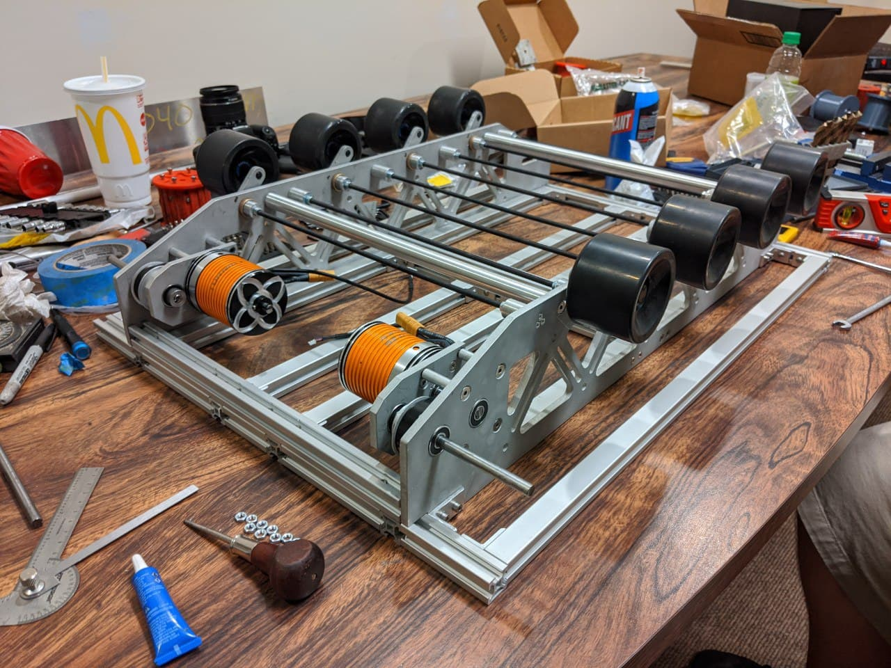
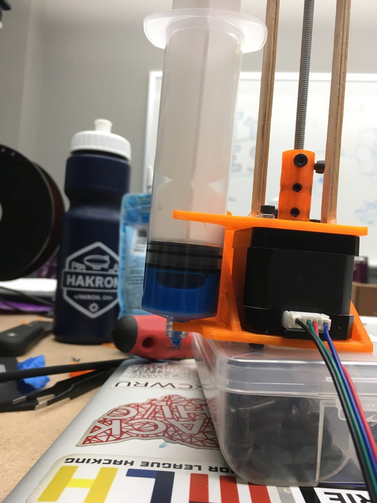
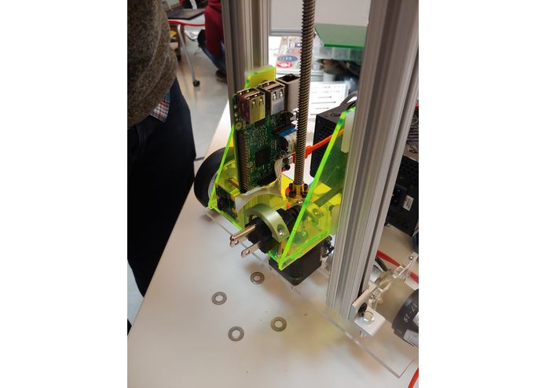
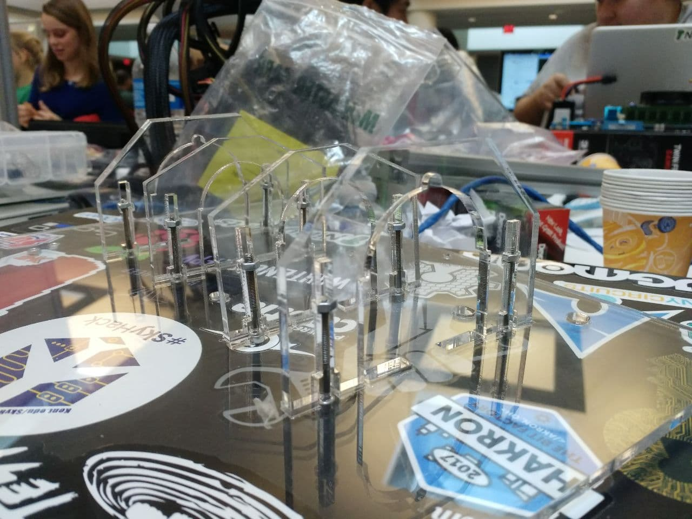
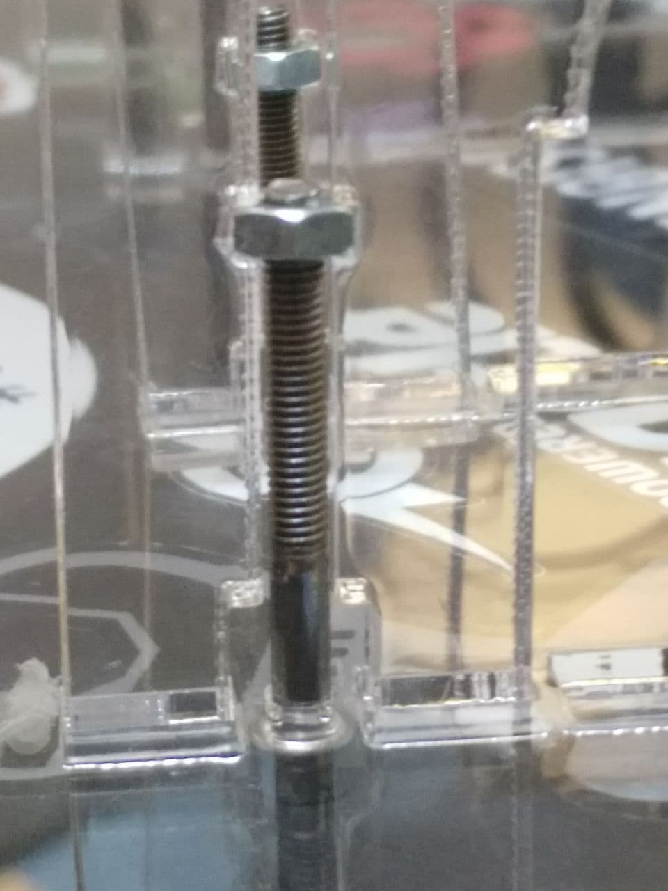
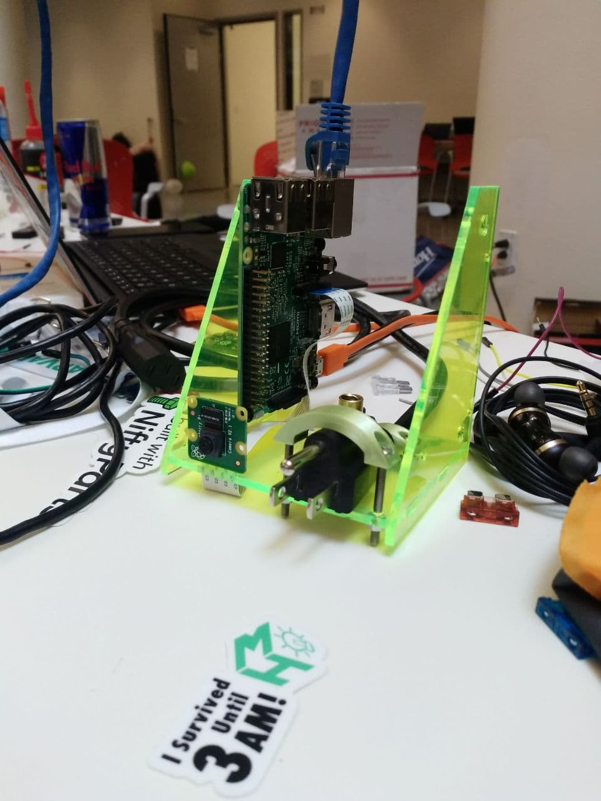

## Introduction to Hackathons

This a page is a curated selection of hackathon projects that I've worked on over my 3+ years at the University of Akron. Most of the hacks on this page are hardware based. A large majority of my hacks involve rapid prototyping techniques such as 3d printing, laser cutting and development with the Arduino and ESP32 platforms. As hardware hackers it is not uncommon to carry around a large box of hardware so as a group we decided to build Auto Tank a robotic pack mule for hackathons as featured below. 

  
 
 

## HAkron 4K  - Leading the Hardware Team 

As a HAkron officer, I got to work with the awesome people at HAkron to put together this amazing weekend of hacking and making at the Bounce Innovation Hub. My primary responsiblty was managing the hardware which meant teams could approach us with unqiue hardware challanges or requests for intresting components. It was amazing getting to see the creativity, ingentuity and passion people brought with their projects. I was able to help over 20+ students build a wide variety of hardware projects over a 24 hour time span. 

## HAkron 3000 - Nifty Cakes

Worked with a team to convert a CoreXY 3d printer into a custom baked good frosting robot. A stepper driven mechanism was designed and printed by the printer. Which was then transformed it a baked goods decorating machine. This unique project was a great deep dive into customization with hardware and firmware on the Creality 3d printer board. 

**Won Most Complex Hardware Hack**

## MakeHarvard 2021: Compliant Prosthetic Finger Design

The prosthetic finger utilizes compliant flexure joints culminating in a mechanism with naturalistic finger kinematics that has the benefits of: a reduced parts count (a "print-in-place" design), being light-weight and cost effectiveness -- make it more accessible and practical for the millions of amputees in low socioeconomic situations.  

**Won Best Hardware Hack**

## MakeHarvard 2020: Auto-safety for the Autonomous 

Auto-safety for the Autonomous is prototype reinforcement learning platform that utilzes custom software and a laser cut RC car. 
To demo this idea, we built a custom laser cut acrylic RC car with an Arduino and ESP32. We used an array of HC-SR04 ultrasonic sensors to measure distances from each edge of the robot. OpenAI Gym  was used to build a custom physics engine and environment for this vehicle, and ran the learning algorithm on Google's Deep Learning VM. It can be shown in both simulation and the real-world how the algorithm can be used to reject unsafe actions and replace them with safe ones, preventing collisions and preserving the robot. 

## MakeHarvard 2019 - Bit Bandit 

We started with the premise that cryptocurrency mining is expensive. So why not borrow other people's power to make some money?
Bit Bandit is an acrylic robot that uses OpenCV on a Raspberry Pi to look for power outlets, plugs itself in, begins money making and runs away when it detects an intruder! The robot was built on a laser cut frame which is powered by two Harbor Freight Drill motors, a custom H-Bridge, and stepper motor system. Mounted on top of this is fully fledged Bitcoin Mining rig powered by a overclocked graphics card. A major challenge was that the we had to make a custom H-Bridge circuit for driving our motors as the ones we bought were not rated for the 30amps the drill motors draw. Another major hurdle was machining adapters for the drill motors as they were M10x1 thread and need to adapt to 1/4-20 thread which was our wheel. Shoutout to the guys at MITERS for their help with machining! All parts were locally sourced from Boston such as Altec Plastics, MITERs, and the MakeHarvard Machine shop. We learned that building ridiculous projects is really fun and rewarding and plan to be finding an outlet near you and begin mining!

## Kent Hack Enough 2019 - Respondash 

Respon-dash is unique product that utilizes a visual alerting system. Using a light sensor, Respon-dash's outer component is on the look out for flashing lights, like those from a police car, behind the vehicle. If flashing lights are detected, then it sends a 'ping' to Respon-dash's inner component, which flashes briefly in the driver's peripheral vision, alerting them to a potential situation that they may need to respond to. Respon-dash is built with two Arduino Unos, a pair of NRF24L01 wireless modules, a photo resistor, KY-037 sound detection sensor, and a Neo Pixel Indicator LED. 

**Won Best Hardware Hack** 

## Lessons Learned from Hackathons 
1. Have Fun! It's awesome getting to work with a wide variety of people and really build something cool. 
2. Not everything is going to go right the first time. So plan ahead and set aside more time than you think you need for troubleshooting/debug. 
3. Bringing together a great team and learning something new is more important than winning. 