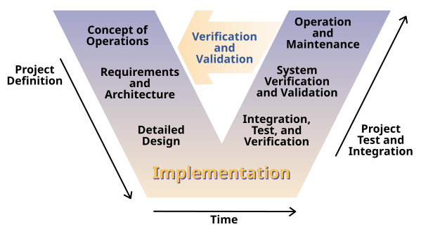

---
title: Hardware is Hard - Updated for 2025 
description: Thoughts and Musings on Hardware Development in the Midwest and Beyond
date: 2025-05-19
tags: ['Electronics']
categories:
    - Hardware development 
    - Electronics
---
*The views expressed are solely **my own** and **do not necessarily reflect those of my current employer**.

## Introduction to Hardware 

Hardware. What exactly is it? Why is it important. Why is it hard? Since the dawn of time there has been hardware engineers. 

I live and work in the Midwest — a region deeply rooted in manufacturing excellence. With its central location, established logistics networks, mild climate, and skilled labor pool, this area has long been a hub for making things. My goal is to explore how we can accelerate hardware innovation here — particularly in Columbus, Ohio and the surrounding areas.

 My goal is to explore building hardware in Columbus and its surround areas. I hope you will join me on learning more on my journey to building hardware quicker. 

This will be the first in a series of posts chronicling my journey to build hardware **faster, smarter, and closer to the customer**. 

## The V Model of HW/SW Development: 

This model of software development was established by both Germany and the United States in the late 1980s as a way to effectively manage projects. Both countries simultaneously but independently The goal of these model is to provide a linear flow for planning and guidance to reduce project risks, improve and guarantee quality, reduce overall cost of the project and improve communication between all stakeholders.

Why the V Model is so successful is that is is able to do the following very well. 

* Reduce project risks 
* Improve quality and tracibilty 
* Control costs 
* Clarify communication between stakeholders 

This model is still widely used in industries where mistakes are costly: aerospace, automotive, and medical devices. But it has one major flaw: **rigidity**.

## Agile Hardware Development: 

Most modern hardware should be based on the principles of fail fast fail cheap, learn quickly. The reality of hardware is that it is inherently hard, but it doesn't need to be. I'll be sure to note the exceptions to this - namely regarding safety critical systems and cover my thoughts on those in a seperate blog post. 

To build hardware one must be willing to iterate by understanding how to get close to customer and simulating when needed. 

The biggest hinderance to modern development is to separation of hardware and software. **The reality is that hardware and software must be developed in tandmem.** That requires integrated planning, continuous validation, and built-in feedback .

The traditional V-Model assumes that each step is linear and complete before the next begins. But real-world projects are messy. You don’t always know all the requirements upfront. Things change. And rigid processes struggle to adapt.

The biggest issue is that planning for issues in hardware is hard without knowledge and experience. 

The linear flow of current hardware development is reliant on this knowledge and experience. In reality there is no substitute for this however the reality is that the V model is so focused on this linear flow that it becomes painful to implement as there is no deviation from the stage that you are in the V. Items may occur simultaneously but often times that doesn't produce customer oriented results. 

## A Comparsion of Software vs. HW Development Time Frames
* An average software sprint time is anywhere from two week to one month.
* Whereas an average hardware development flow ranges from a shorter span of 1-2 years - or more. 

But this gap is shrinking. Thanks to 3D printing, digital twins, better simulation tools, modular design, and rapid prototyping, we can now build physical systems with more speed and agility than ever before.

We no longer have to subscribe to the "build it and they will come" mentality. We can instead ask:

**What does the customer actually need, and how can we get there faster — with less waste?**

My goal is to create a series of posts highlighting what does an ideal LEAN hardware development flow. I hope to provide some insight and am open to feedback. 

## My Mission: Building an Ideal Lean Hardware Development Flow

Over the next few posts, I’ll explore what an ideal Lean-inspired hardware development process looks like.
I’ll dive into:
* Where traditional hardware development breaks down
* How Agile and Lean can be adapted for hardware
* How to iterate faster without compromising quality
* Real tools and examples from the Midwest manufacturing ecosystem

This isn’t just a technical exercise. It’s about reshaping how we think about building physical products — from mechanical devices to embedded systems.

If you’re a maker, builder, engineer, or startup founder who wants to build hardware better, I hope you’ll follow along. And I welcome your feedback, insights, and challenges along the way.

Let’s build something together — faster, smarter, and with purpose.

