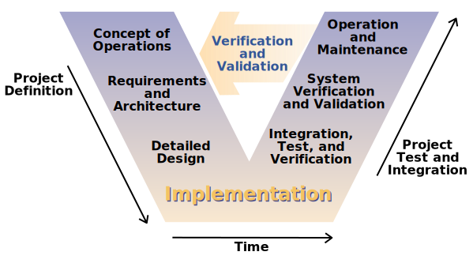

---
title: Hardware is Hard 
description: Thoughts and Musings on Hardware Development
date: 2022-05-02
tags: ['Electronics']
categories:
    - Hardware development 
    - Electronics
---
## Introduction to Hardware 

Hardware. What exactly is it? Why is it important. Why is it hard? Since the dawn of time there has been hardware engineers. 

The Midwest is an area known for manufacturing excellence. Its unique geographic location, mild climate, and proximity make it desirable for the development of hardware products. 

The V Model of Hardware and Software Development: 

This model of software development was established by both Germany and the United States in the late 1980s as a way to effectively manage projects. Both countries simultaneously but independently The goal of these model is to provide planning and guidance to reduce project risks, improve and guarantee quality, reduce overall cost of the project and improve communication between all stakeholders.

Agile Hardware Development: 

Modern Hardware should be based on the principles of fail fast fail cheap. The reality of hardware is that it is inherently hard, but it doesn't need to be. To build hardware one must be willing to iterate by understanding how to get close to customer. The biggest hinderance to modern development is to separation of hardware and software. Instead, it should be one and it’s about integrating testing, validation, and planning for issues. The biggest issue is that planning for issues in hardware is hard without knowledge and experience. 

The linear flow of current hardware development is reliant on this knowledge and experience. In reality there is no substitute for this however the reality is that the V model is so focused on this linear flow that it becomes painful to implement as there is no deviation from the stage that you are in the V. Items may occur simultaneously but often times that doesn't produce results that are customer oriented. 

An average software sprint time is anywhere from two week to one month. Whereas an average hardware development flow ranges from a shorter span of 1-2 years to 3-5+ years depending on the industry. The reality is that we have the tools, software, and innovations at hand to shorten this development flow. The shorter time to iteration the closer to customer we can be. This starts with changing the mentality of hardware which has been "We build it and they will come" into let’s build something of value to the customer.

My goal is to create a series of posts highlighting what does an ideal LEAN hardware development flow. I hope to provide some insight and am open to feedback. 

