## Introduction to Keyboard Warrior

This a page about the Keyboard Warrior which was my Senior Project for my Electrical and Electronic engineering degree at the University of Akron.  

## Hardware Layout & Design Considerations

The badge is based on STM32F303RET6 processor which has 26 I/O, builtin 512kB of flash memory, 80kB of RAM, and operates at 3.3 volts with a max clock frequnecy of 72 MHz. Communication and debug on this board consisted of DFU (Device Firmware Update) via USB C and a SWD(Serial Wire debug) port. This project was split into two parts one being the main devboard that had STM32F303 and a daughter board being a keyboard with deattachable accessories. The fimware on the board is the QMK (Quantum Mechnical keyboard) and is very customizable. Some highlights regarding design include the pogo pin connector for modular attachments via I2C bus, design for high USB connection, crystal oscillator and power supply layout. 

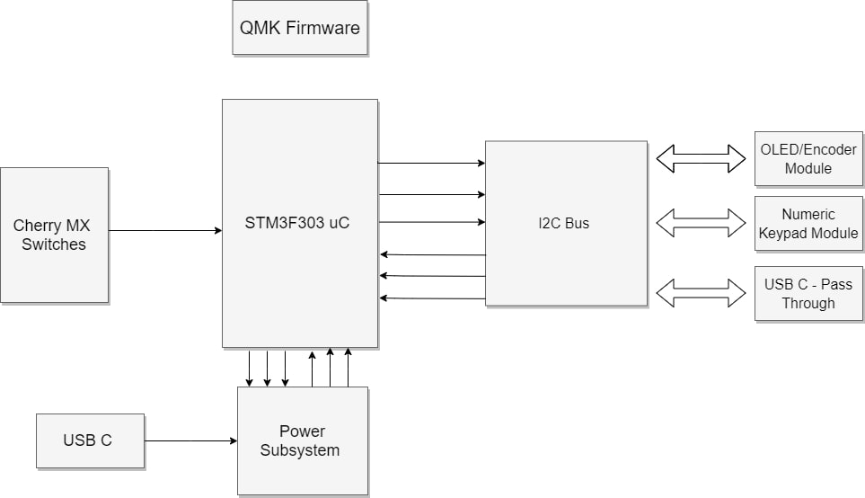

The block diagram outlines what I envisioned as the ultimate modular mechanical keyboard that has a wide variety of attachments that would fit any situtation. With the addition of an I2C bus on the keyboard this would allow for a variety of expansions but the main focus for this project was the Numeric Keypad module as it was most realistic given the time frame for this project. Schematics are included below and are broken into a uC development module, the main keyboard and the attachment keyboard. 

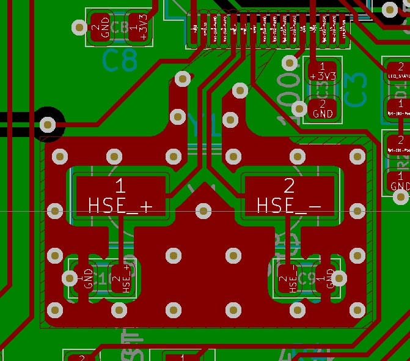
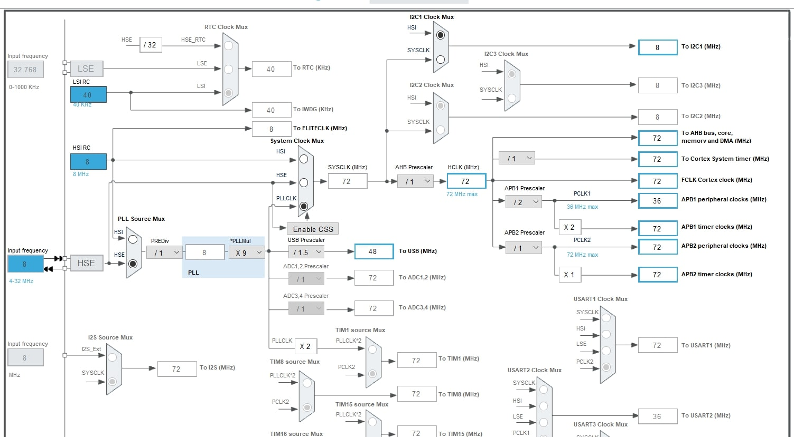

The crystal oscillator layout was an area that I focused on when designing the dev board. The ST Microelectronics AN2867 application note was very informative on the design of Pierce oscillators which are critical to the ensuring stable and reliable operation from the microcontroller. The goal of this design was to generate a 48 MHz clock which was required by the USB protocol. STM32 Cube IDE has a Clock Frequency configurator which validated my selection of the J49SMH which is 8 MHZ quartz oscillator at ±30ppm with a load capacitance of 12 pF. 

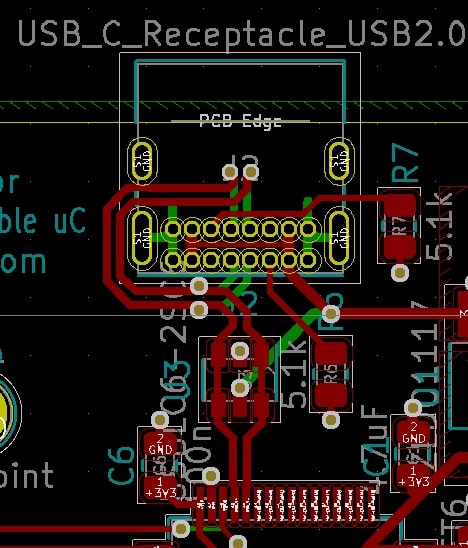
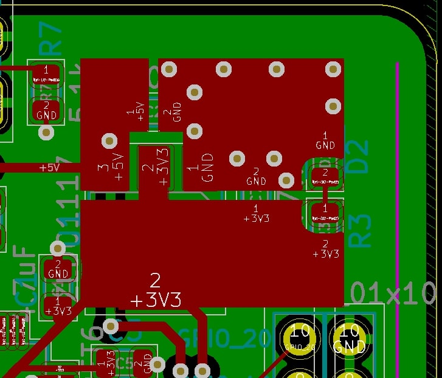

The USB C protcool requires that signal runs be as short as possible and the data line pairs be differentially routed as to minimize issues with signal quality. Note that USB ESD protection chip was also placed inline with the STM32F303 microcontroller. Thought was also put into my DRC rules and power supply design. 

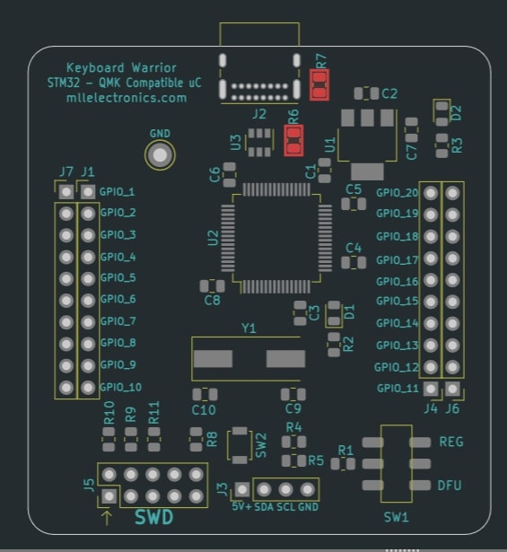
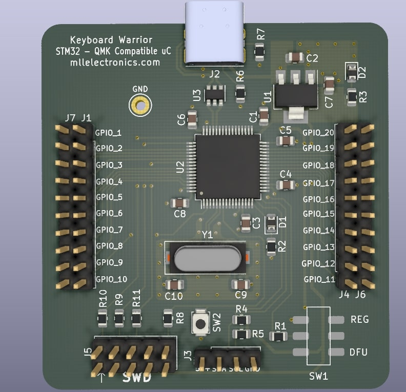

This layout is a standard microcontroller layout that follows sound engineering practices that emphasize stability, functionality and reliable design. 

## Mechanical Design 
The case is made of combination of 1/16th and 3/16th stacked 6061 aluminum that sandwhiches the main keyboard circuit board. It utilzes Torx screws to hold the everything together. All CAD modeling was done in Solidworks 2020 to make sure that everything fit and CAM was done with the WardCAM software. One the biggest challanges was cutting out the 1/16" 6061 on the waterjet as cutting materials under 1/8" is difficult due the turbulence of the jet stream flexing the thin metal plate. 

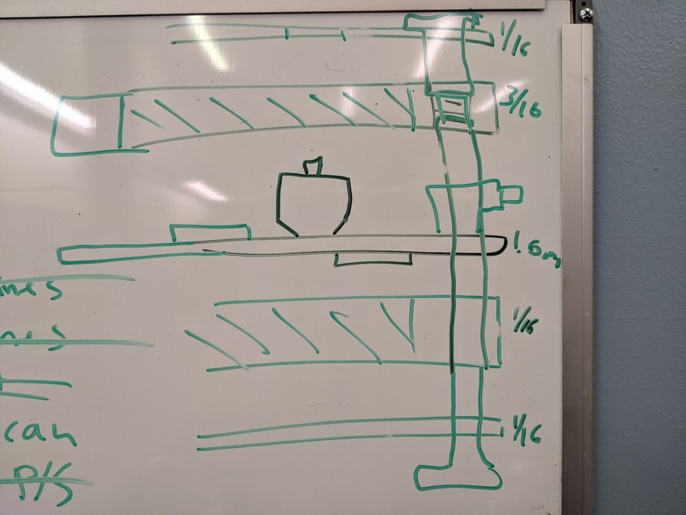

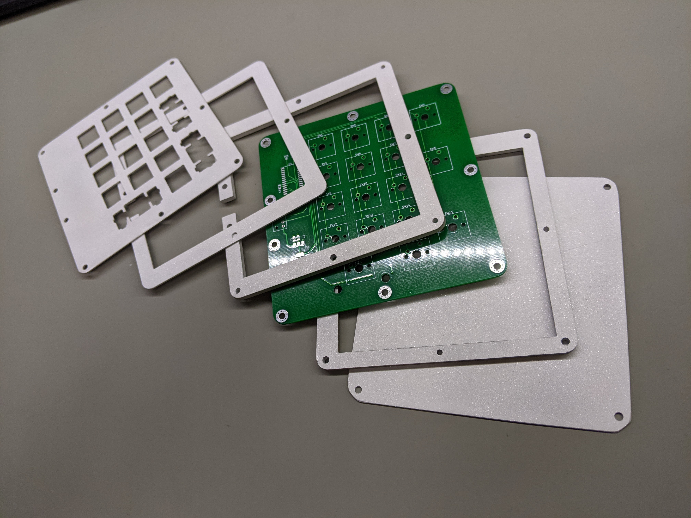

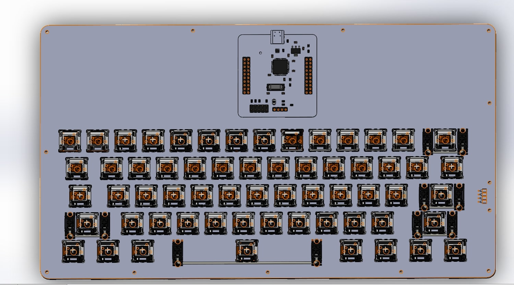
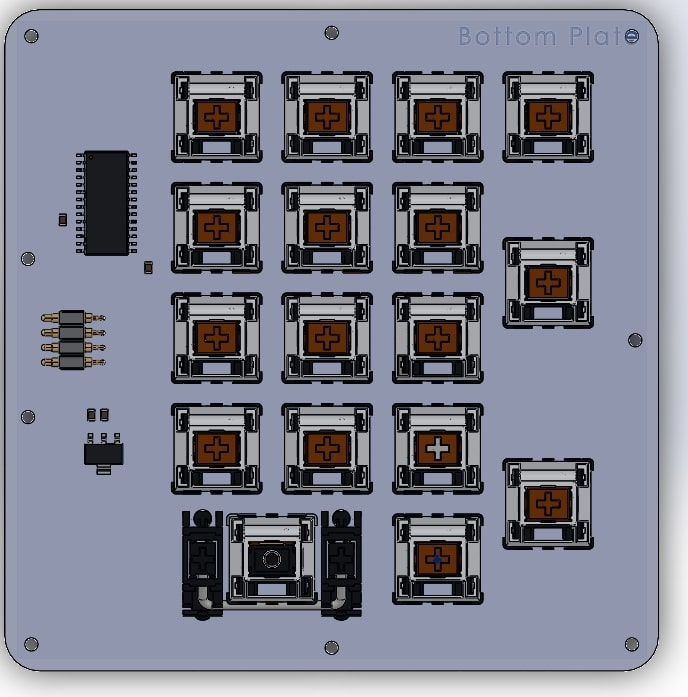

## Software Used 
* KiCad V5.1 - PCB Schematic and Electronic Design Software
* STM32 Cube IDE  - PLL Clock configurator and intial testing of STM32F303  
* Solidworks 2019 - Mechanical design software 
* WardCAM - Waterjet custom case  

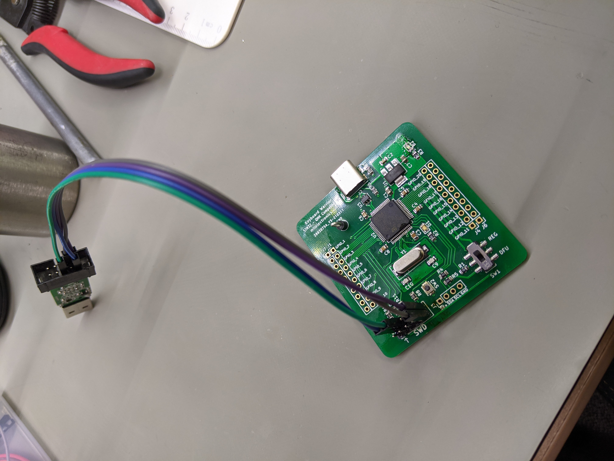

## Lessons Learned 
1. Don't underestimate the time it takes to write embedded software 
2. Tolerance stacks matter and header pins add height which need to be accounted for

## Future Plans 
* Keyboard Warrior V2 - Builtin USB 3.0 Hub, RGB back light and new 80% keyboard layout 
* Continue development on the I2C bus code and additional acessories 

