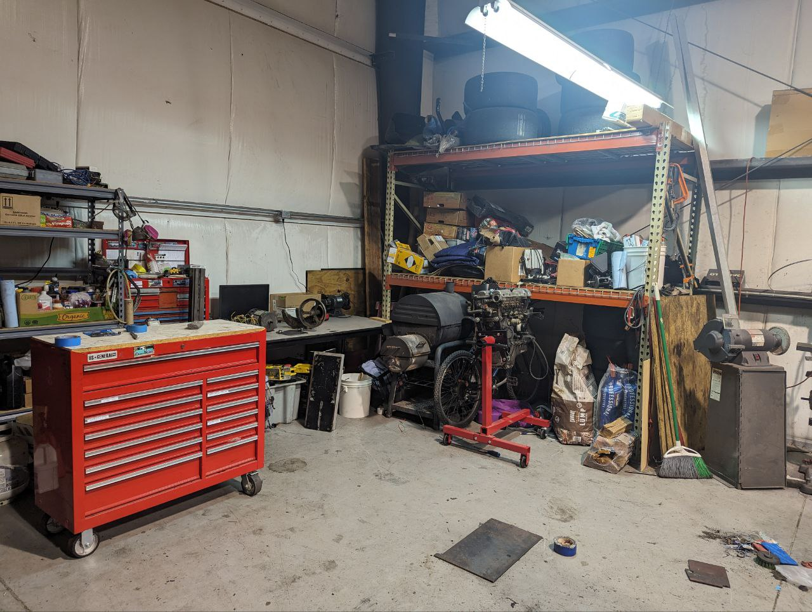
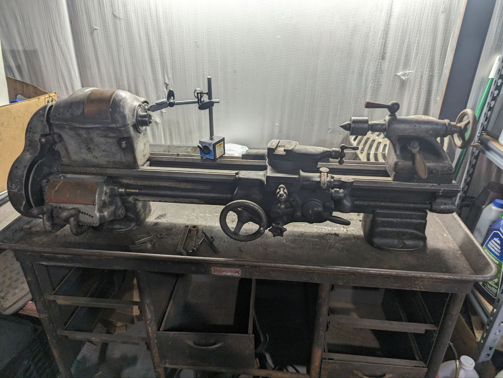
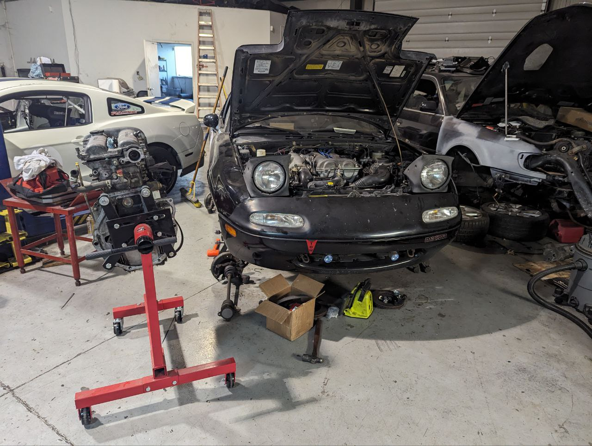
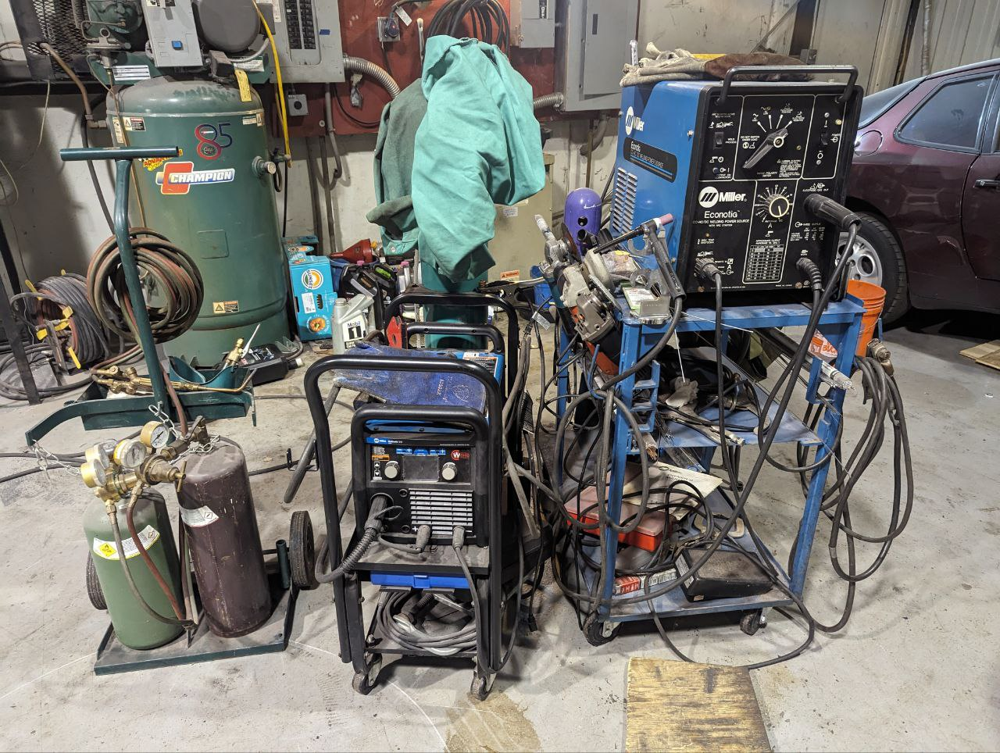

## Resume 
If you are interested in my resume - please download from this link. 

Download: [pdf](/Michael_Liang_Engineering_Resume_Spring_2024.pdf) 

## Professional Experience

Honda R&D America : Marysville , OH Jan 2022 - Present

Autonomous Systems Engineer
* Led ECU system level development and validation across multiple vehicle models from project kick off to mass
production while working cross functionally to define, design and perform tests.
* Designed and implemented both HILS and on vehicle solutions for validating new and existing regulatory requirements
for ECU development.
* Focused on FMEA, test design, dynamic and static testing of TCU (Transmission controllers) for the first year and
a half. Transitioned into the Autonomous Systems role where I am currently developing a localized HILS bench for
next gen ADAS system
*Technologies Utilized: Automotive Bus (CAN, Ethernet), ETAS, VECTOR, IPEtronik, and CATIA

Toast Inc : Boston, MA Jun 2021 - August 2021
Electrical Engineering Co-op
* Fabricated a fully custom automated robotic hardware testing platform based on the ESP32 microcontroller.
* Worked closely with a cross disciplinary team of engineers to create detailed specifications for an upcoming tablet.
Collaborated with ODM/JDM manufacturing vendors through out the product development lifecycle.
* Analyzed and reviewed designs with multiple high speed signals such as MIPI, LVDS, gigabit ethernet and USB C.
* Technologies Utilized: ESP32, Python, Fusion 360, RF Explorer, and PADs viewer.

WardJET - Waterjet Cutting Machines : Tallmadge, Ohio May 2020 - May 2021
Electrical Engineering Co-op
* Designed and implemented multiple data collection and analysis systems to assist with root cause analysis of clogs in
cutting operations.
* Worked closely with engineers to develop processes for prototyping, testing and manufacturing of microphones and
electronics for usage in waterjet process.
* Technologies Utilized: Python, Digital Signal Processing,Raspberry Pi, and MATLAB.

University of Akron Undergraduate Research: Akron, Ohio Sep 2018 - March 2019
Lab Assistant for LTA Research & Exploration
*Worked closely with a multi-disciplinary team to develop custom rapid prototyping and fabrication solutions for a
innovative Unmanned Aircraft System.
* Retrofitted new safety equipment, maintained, and calibrated a 300 watt industrial laser cutter.
* Maintained a print farm of over 15 industrial-grade 3d printers which ran 24/7.
* Technologies Utilized: SolidWorks 2018, Simplify3D, Octoprint, and RDWorks laser controller software.

Focused on building products and prototypes quickly in my free time. Developing a strong capability both electrically and mechanically. Split into an Electronics lab with additive manufacturing capability and 2000 sq ft shop space with equipment/tools and machines need for general fabrication and automotive repair. 

Some Highlights include: 

Electronics Fab 
- Programmable Power supplies - GPIB/Serial/Analog 
- Data Aquisition units - Fluke Hydra II DAQ, HP Programmable AC/DC Multimeter
- Oscilloscopes: Tektronix 100 mHz dual chanel analog, Siglent 50 mhZ dual channel digital 
- Hakko FX888D Soldering Station 
- Generic Chinese Hot Air reflow station 
- Circuit Specialist - Reflow board preheated 
- Wiring harness fab tools 
    - Automotive harness 
    - Automation panels 
 MLL Electronics Reflow oven *Still in development - custom reflow controller

Metal Working/General Fab 
- Miller Econo TIG; AC/DC up to 100 amps 
- Miller Matic 142 MIG Welder 
- 3D Printers - Voron 2.4r2, Ender 3, EPAX X1 SLA Resin 
- Drill press 
- Craftsman Belt sander
- Horizontal Band saw
- LMS 3990 CNC mill - *Restoration still in progress
- Southbend 9A lathe - *Restoration in progress 

Shop Pics Below: 

    